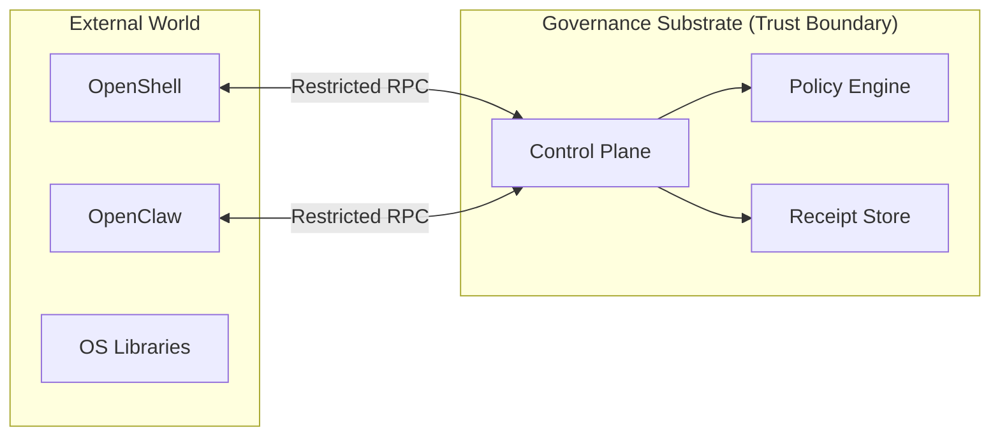

<!-- SPDX-FileCopyrightText: Copyright (c) 2026 NVIDIA CORPORATION & AFFILIATES. All rights reserved. -->
<!-- SPDX-License-Identifier: Apache-2.0 -->

# Dependency Governance Map

This document maps the external dependencies of the NemoClaw substrate and defines the governance guardrails established to prevent "dependency drift" from compromising execution integrity.

## Governance Boundary

The NemoClaw substrate maintains a strict boundary between its core control plane and external libraries. Governance decisions are never delegated to external dependencies.

## Critical Dependency Inventory

| Dependency | Role | Governance Risk | Mitigation |
|---|---|---|---|
| **OpenShell** | Execution Sandbox | Runtime escape or policy bypass. | SSRF validation, Docker capability drops. |
| **OpenClaw** | Agent Interface | Unauthorized tool execution. | Slash-command interception, explicit tool gating. |
| **Node.js Runtime** | Execution Host | Vulnerabilities in core modules. | Strict Node version enforcement (22.x+). |
| **Biome** | Lint/Format | Introduction of accidental complexity. | Strict, deterministic configuration. |
| **Vitest** | Verification | False-positive test results. | Deterministic test seeding, isolated execution. |

## Dependency Drift Protections

### 1. Lockfile Integrity

The `package-lock.json` is treated as a governance artifact. Any change to the lockfile must be audited against the **Capability Status Matrix** to ensure no new unplanned capabilities or risks are introduced.

### 2. Supply Chain Hardening

- **No Dynamic Imports**: All dependencies must be statically declared. `eval()` and dynamic `require()` are prohibited in the control plane.
- **Minimal Surface Area**: The substrate intentionally avoids high-level "frameworks" to keep the dependency tree shallow and auditable.
- **SPDX Compliance**: Every dependency must have a valid SPDX license header, verified during CI.

### 3. Execution Isolation

The substrate does not trust its dependencies to be well-behaved.

- **Sandbox Confinement**: All code related to OpenClaw or OpenShell interactions is confined within the sandbox boundary.
- **Fail-Closed Fallback**: If a critical dependency (e.g., the policy evaluator) returns an ambiguous or malformed result, the substrate defaults to a "Deny" decision.

## Upstream Governance Alignment

The substrate aligns its governance lifecycle with the release cycles of its primary upstream partners:

| Partner | Alignment Strategy |
|---|---|
| **NVIDIA OpenShell** | Continuous compatibility testing against the latest sandbox blueprint. |
| **OpenClaw.ai** | Tracking tool-schema changes to ensure policy definitions remain effective. |
| **Brev.dev** | (Deprecated/Legacy) Alignment maintained only for backward-compatible E2E testing. |
