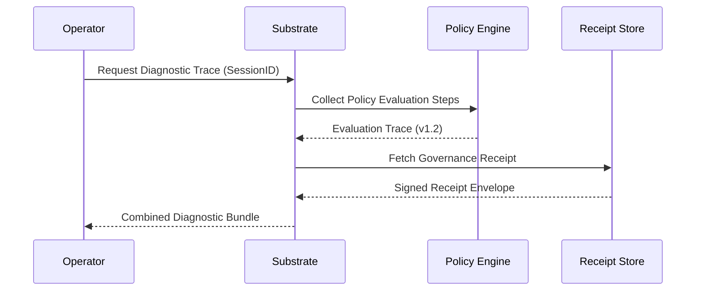

<!-- SPDX-FileCopyrightText: Copyright (c) 2026 NVIDIA CORPORATION & AFFILIATES. All rights reserved. -->
<!-- SPDX-License-Identifier: Apache-2.0 -->

# Diagnostics Surface Map

This document maps the diagnostics surface of the NemoClaw substrate, detailing how operators and verification suites can observe internal state, performance, and failure modes.

## Observability Layers

The diagnostics surface is organized into three primary layers:

### 1. Control Plane Heartbeats

The control plane emits heartbeats to signal its operational health and readiness to the supervisor.

| Probe | Frequency | Payload | Purpose |
|---|---|---|---|
| `sys.heartbeat` | 5s | Status (Ready/Busy/Degraded) | Basic liveness signal. |
| `gov.readiness` | 10s | Policy Version, Registry Checksum | Governance integrity signal. |
| `res.pressure` | 30s | Queue depth, latency p95 | Resource throughput diagnostics. |

### 2. Trace Streams

Execution traces provide high-fidelity insights into individual control-plane decisions.

### 3. Log Aggregation Semantics

Logs are structured to ensure unambiguous mapping to governance events.

- **`[TRC]`**: Trace level - Internal function calls (Non-governance).
- **`[INF]`**: Info level - Standard lifecycle events.
- **`[WRN]`**: Warning level - Degraded but operational states (e.g., staleness).
- **`[ERR]`**: Error level - Critical failures (Fail-closed triggers).
- **`[GOV]`**: Governance level - Explicit policy decisions (Always logged at INF+).

## Diagnostic Endpoints

### Internal (Localhost Only)

| Endpoint | Method | Data Provided |
|---|---|---|
| `/diag/health` | GET | Liveness and basic readiness. |
| `/diag/policy` | GET | Current effective policy and recent promotion history. |
| `/diag/registry` | GET | Snapshot of the Device/Candidate registry. |
| `/diag/metrics` | GET | Prometheus-formatted resource metrics. |

### External (Supervisor Only)

| Endpoint | Method | Data Provided |
|---|---|---|
| `/governance/audit` | GET | Export of recent signed receipts. |
| `/governance/replay` | POST | Trigger a deterministic replay of a specific trace. |

## Failure Diagnostics (Fail-Closed)

When the substrate enters a fail-closed state, it emits a `diag.error.fail_closed` event with the following extended context:

1. **Failure Vector**: (e.g., `PolicyMismatch`, `RegistryStale`, `ReceiptSigningError`).
2. **Last Known Good (LKG)**: The timestamp and checksum of the last successful governance decision.
3. **Entropy Score**: A measure of divergence between observed state and expected state.
4. **Recovery Hint**: Suggested operator action (e.g., `ManualPolicyReset`, `CredentialRotation`).
