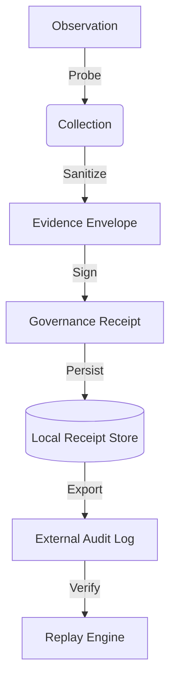

<!-- SPDX-FileCopyrightText: Copyright (c) 2026 NVIDIA CORPORATION & AFFILIATES. All rights reserved. -->
<!-- SPDX-License-Identifier: Apache-2.0 -->

# Evidence and Export Lifecycle

This document details the lifecycle of evidence within the NemoClaw substrate, from initial collection during execution to final archival and verification.

## Evidence Lifecycle Overview

The substrate treats evidence as the primary artifact of governance. Every control-plane decision must be backed by a verifiable chain of evidence.

## 1. Collection (Probes)

Evidence is collected via synchronous "Probes" that run before and during policy evaluation.

| Stage | Probe Type | Evidence Collected |
|---|---|---|
| **Pre-Flight** | `IdentityProbe` | Caller credentials, role, and attestation. |
| **In-Flight** | `NetworkProbe` | Egress targets, connection metadata. |
| **Post-Flight** | `OutcomeProbe` | Exit codes, resource consumption metrics. |

## 2. Packaging (Envelopes)

Collected raw data is packaged into an **Evidence Envelope**.

- **Normalization**: Timestamps are converted to UTC; sensitive values are masked.
- **Context Injection**: Each envelope is tagged with the current `PolicyID` and `SubstrateVersion`.
- **Deterministic Hashing**: The envelope content is hashed to create a unique identifier for the execution trace.

## 3. Signing (Receipts)

Envelopes are transformed into **Governance Receipts** via cryptographic signing.

- **Integrity**: The signature ensures the evidence has not been tampered with since collection.
- **Non-Repudiation**: The signature binds the substrate's identity to the governance decision.
- **Fail-Closed**: If the signing service is unavailable, the substrate triggers a `diag.error.fail_closed` and blocks further execution.

## 4. Export (Audit Trails)

Receipts are exported to external systems for long-term storage and cross-substrate auditing.

### Export Methods

1. **Synchronous Push**: Receipts are pushed to a supervisor-controlled endpoint immediately after signing (Preferred for high-security environments).
2. **Asynchronous Batch**: Receipts are buffered locally and exported periodically (Optimized for performance).
3. **On-Demand Pull**: Receipts are stored locally and retrieved by the operator during audit cycles.

## 5. Verification (Replay)

The ultimate stage of the evidence lifecycle is verification through the **Replay Engine**.

- **Deterministic Reproduction**: The Replay Engine uses the exported receipt to recreate the exact state and inputs of the original decision.
- **Lineage Validation**: Verifies that the decision followed the documented lineage (See [Replay Lineage](replay-lineage.md)).
- **Audit Reports**: Produces a PASS/FAIL verdict on the integrity of the exported evidence.

## Retention Policy

By default, the substrate maintains a local circular buffer of receipts:

- **High-Fidelity (Full Traces)**: 24 hours or 1GB.
- **Governance Receipts (Summaries)**: 30 days or 10GB.
- **Archival**: Responsibility of the external export consumer.
