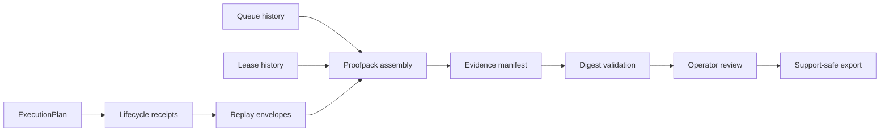

<!-- SPDX-FileCopyrightText: Copyright (c) 2026 NVIDIA CORPORATION & AFFILIATES. All rights reserved. -->
<!-- SPDX-License-Identifier: Apache-2.0 -->

# Evidence Topology

## Proofpack / evidence chain

## Implemented

The execution lifecycle proofpack is implemented in `src/lib/control-plane/execution-lifecycle.ts` as a deterministic, serializable evidence object. It includes:

- execution plan
- execution receipts
- replay envelopes
- telemetry lineage
- governance lineage
- trust lineage
- diagnostics snapshots
- degraded-state artifacts
- lease history
- queue history
- execution transitions
- evidence manifest

Every artifact has a deterministic digest. `validateExecutionProofpack(...)` recomputes the manifest and package digests and fails closed on proofpack tampering, receipt mismatch, replay drift, lineage drift, missing queue or lease history, missing receipts, hidden recovery evidence, and hidden retry evidence. Digest attestations are integrity evidence, not cryptographic identity signatures; cryptographic signing remains outside the current implementation.

## Explicit unavailable truth

Unavailable evidence is represented directly in the proofpack, not fabricated. For example, telemetry can be included as an unavailable lineage artifact with a reason code. Missing history remains a validation failure when that history is required to review the execution lifecycle.

## Intentionally not implemented

- background proofpack collection
- automatic evidence repair
- silent replay reconciliation
- autonomous export scheduling
