# Execution lifecycle substrate

This page documents the implemented deterministic execution lifecycle substrate in `src/lib/control-plane/execution-lifecycle.ts`.

## Status

Implemented as a pure, deterministic operating-layer contract. It does not start workers, poll queues, fan out execution, retry failures, or enable remote execution. Callers must invoke each transition explicitly and persist any resulting records.

## Execution lifecycle topology

```mermaid
flowchart LR
  Governance[Governance metadata] --> Planning[ExecutionPlan]
  Planning --> Queueing[QueueItem]
  Queueing --> Leasing[QueueLease]
  Leasing --> Lifecycle[Execution state machine]
  Lifecycle --> Receipts[Lifecycle receipts]
  Receipts --> Replay[Replay lineage]
  Replay --> Proofpack[Execution proofpack]
  Proofpack --> Diagnostics[Diagnostics snapshot]
```

Implemented contracts:

- `ExecutionPlan`, `ExecutionPlanPhase`, `ExecutionPlanStatus`, `ExecutionPlanInvariant`, `ExecutionPlanApproval`, `ExecutionPlanReceiptReference`, `ExecutionPlanReplayReference`, `ExecutionPlanDegradedState`, and `ExecutionPlanIdempotencyKey`.
- `QueueItem`, `QueueState`, `QueueLease`, `QueueOwnership`, `QueueReplayReference`, `QueueReceiptReference`, and `QueueDegradedState`.
- Deterministic lifecycle receipts and events with stable hash-derived identifiers.

## State machine

Implemented states are `planned`, `queued`, `leased`, `executing`, `completed`, `failed`, `blocked`, `degraded`, `cancelled`, and `expired`.

Legal transitions are explicit:

| From | To |
|---|---|
| `planned` | `queued`, `blocked`, `degraded`, `cancelled`, `expired` |
| `queued` | `leased`, `blocked`, `degraded`, `cancelled`, `expired` |
| `leased` | `executing`, `blocked`, `degraded`, `cancelled`, `expired` |
| `executing` | `completed`, `failed`, `blocked`, `degraded`, `cancelled`, `expired` |
| `blocked` | `degraded`, `cancelled`, `expired` |
| `degraded` | `blocked`, `cancelled`, `expired` |
| terminal states | no outgoing transition |

Illegal transitions fail closed with `invalid_transition`. Expired and cancelled plans also fail closed before non-terminal transitions.

## Queue topology

Queue items preserve ordering with an explicit `sequence`, carry copied governance/trust metadata, and link to the plan replay reference by `replayReferenceId` plus `lineageHash`. Queue entries can be explicitly queued, leased, expired, blocked, degraded, cancelled, failed, or completed. The implementation detects:

- stale queue ownership
- duplicate lease attempts
- expired queue entries
- conflicting ownership
- replay drift
- orphaned execution state

No queue worker, daemon, retry loop, or automatic rescheduling is implemented.

## Lease governance

Lease acquisition, renewal, expiration, and revocation are explicit functions. The layer rejects split-brain ownership, stale owners, duplicate active lease attempts, wrong-owner execution, and expired lease execution. Lease events are reason-coded and receipt-backed:

- `lease_acquired`
- `lease_expired`
- `lease_revoked`
- `lease_conflict_detected`

Lease renewal is still explicit and records a deterministic receipt. There is no hidden renewal loop.

## Replay and idempotency doctrine

Replay validation rejects lineage drift, missing governance metadata, missing trust metadata, missing degraded reasons, degraded state drift, candidate mismatch, ownership mismatch, lease mismatch, and receipt mismatch. Idempotency helpers classify:

- `deterministic_rerun`
- `idempotency_key_conflict`
- `cancellation_safe_replay_blocked`

No silent reconciliation is implemented. A failed validation result is evidence, not a repair instruction.

## Proofpack architecture

`buildExecutionProofpack(...)` builds a deterministic execution proofpack from real plan, receipt, queue, lease, diagnostics, telemetry, governance, trust, replay, and degraded-state inputs. `validateExecutionProofpack(...)` recomputes manifest and package digests and rejects tampering, missing receipts, missing queue or lease history, replay drift, lineage drift, receipt mismatch, hidden degraded state attempts, and hidden retry attempts.

Proofpacks preserve explicit unavailable truth, for example telemetry can be present as `{ state: "unavailable", reasonCode: "telemetry_unavailable" }`.

## Diagnostics and observability

Diagnostics classify facts as `observed`, `inferred`, `unavailable`, `degraded`, `stale`, `conflicted`, `blocked`, or `not_implemented`. The lifecycle diagnostics snapshot covers queue state, lease state, ownership, replay integrity, proofpack integrity, degraded-state propagation, governance lineage, trust lineage, and attestation state.

Operational event taxonomy is expanded for plan, queue, lease, execution, and proofpack events. Observability aggregators count lifecycle event categories and truth-state dimensions without fabricating completeness.

## Operator intervention model

Operators, callers, or tests must explicitly call the next transition. The substrate records what was requested and why; it does not infer operator intent, perform background work, or mask a blocked/degraded state as success.

## Implemented / deferred / non-goals

| Area | Classification | Notes |
|---|---|---|
| Canonical lifecycle contracts | implemented | `execution-lifecycle.ts` |
| Queue and lease state transitions | implemented | Pure functions, no worker loop |
| Replay/idempotency validation | implemented | Fail-closed reason codes |
| Proofpack generation and validation | implemented | Deterministic, serializable proofpacks |
| Execution diagnostics and event aggregation | implemented | Explicit truth-state classification |
| Durable storage adapters | deferred | Callers persist returned records |
| UI rendering of lifecycle proofpacks | deferred | Contracts are ready for operator surfaces |
| Autonomous orchestration | intentionally not implemented | Non-goal |
| Daemon schedulers / polling loops | intentionally not implemented | Non-goal |
| Hidden retries / autonomous recovery | intentionally not implemented | Non-goal |
| Speculative fanout / distributed execution fabric | intentionally not implemented | Non-goal |
| GPU balancing / Dynamo integration | intentionally not implemented | Non-goal |

## Anti-theatre constraints

- autonomous orchestration
- daemon schedulers
- hidden retries
- speculative execution
- automatic fanout planning
- automatic policy learning
- implicit remote execution enablement
- fabricated telemetry, proofpack, or diagnostics completeness

## Verification

- `npm run verify:execution-lifecycle`
- `npm run verify:chaos`
- `npm run verify:core`

`src/lib/control-plane/execution-lifecycle.test.ts` validates transition legality, governance metadata loss, degraded-state propagation, queue/lease conflict handling, split-brain ownership, stale owners, replay drift, receipt drift, trust invalidation, cancellation-safe replay, proofpack mismatch, hidden recovery detection, hidden retry detection, diagnostics truth states, and lifecycle event aggregation.
