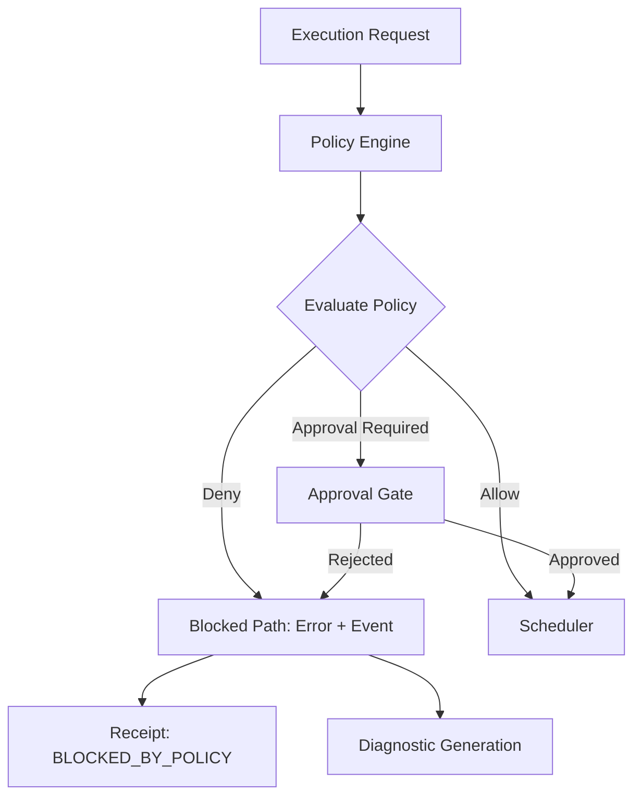
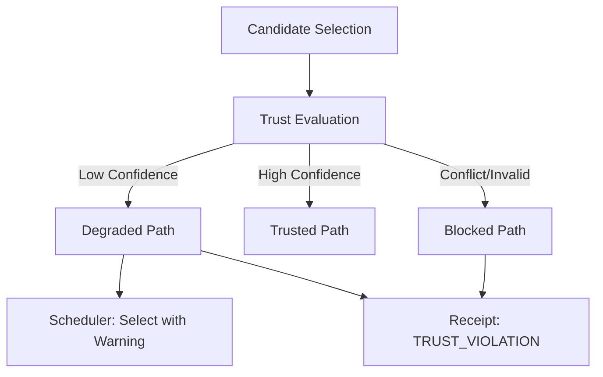
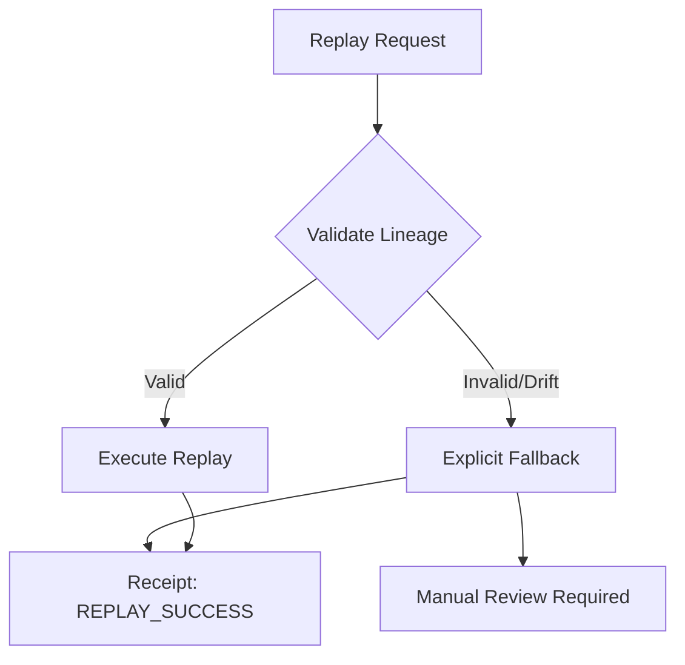
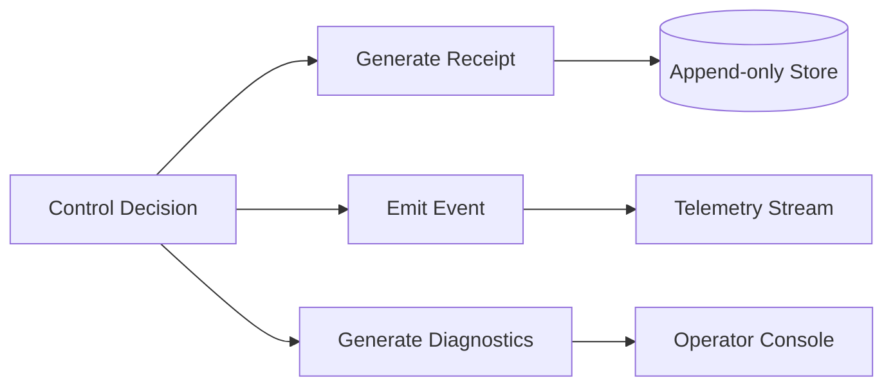

<!-- SPDX-FileCopyrightText: Copyright (c) 2026 NVIDIA CORPORATION & AFFILIATES. All rights reserved. -->
<!-- SPDX-License-Identifier: Apache-2.0 -->

# Governance Flows

This document details the control-plane decision logic and the explicit handling of blocked or degraded execution paths.

## Policy Evaluation and Approval Gating

Policy is the primary gate for all execution decisions. There is no hidden fallback to "allow" if a policy check fails.

## Trust Gating and Degraded-State Handling

Trust levels are derived from evidence and gating rules. Degraded states are surfaced explicitly to the operator.

## Replay Validation and Fallback Handling

Replay validation is a mandatory check for governance integrity. Fallback behavior is always explicit and governed.

## Evidence Trail Generation

Every decision flow terminates in a machine-readable receipt and a corresponding event emission.

## No Hidden Fallback Guarantees

1. **Policy Failure:** If the policy engine is unavailable or errors out, the system fails-closed (BLOCKED).
2. **Registry Staleness:** If the device registry data is beyond the staleness threshold, the candidate is marked as DEGRADED or BLOCKED.
3. **Approval Timeout:** If an approval gate times out, the request is REJECTED.
4. **Replay Drift:** If replay cannot reproduce a decision, it does not "guess" the intent; it triggers a DRIFT_REJECTION.
