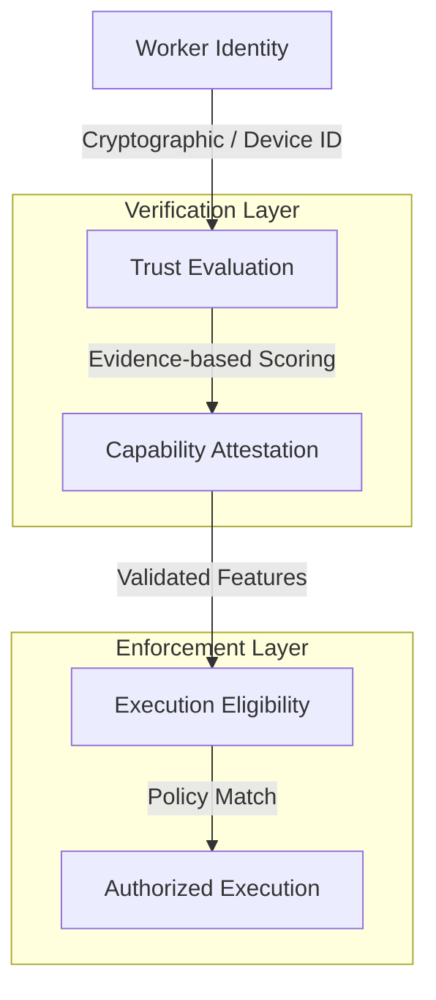

<!-- SPDX-FileCopyrightText: Copyright (c) 2026 NVIDIA CORPORATION & AFFILIATES. All rights reserved. -->
<!-- SPDX-License-Identifier: Apache-2.0 -->

# Governance Map

This document outlines the mechanics of governance, policy enforcement, and trust within the NemoClaw substrate.

## 1. The Trust Cascade

NemoClaw establishes execution eligibility through a deterministic "Trust Cascade." Each step must provide evidence-backed confidence before proceeding to the next.



### 1.1 Worker Identity

- **Source**: `device-registry.ts`
- **Mechanism**: Unique IDs mapped to specific hardware/software configurations.

### 1.2 Trust Evaluation

- **Source**: `worker-trust.ts`
- **Logic**: Evaluates worker reliability, past performance, and security posture.

### 1.3 Capability Attestation

- **Source**: `worker-probes.ts`, `local-runtime-probes.ts`
- **Logic**: Probes confirm the physical existence of claimed capabilities (e.g., specific GPU models, disk space, network access).

## 2. Policy Enforcement Points (PEPs)

PEPs are the specific locations in the codebase where the Policy Engine is invoked to make an authorization decision.

| PEP Location | Trigger | Context | Implementation |
|--------------|---------|---------|----------------|
| **Runtime Dispatch** | Command entry | Is this command allowed for this user/environment? | `runtime-dispatch-integration.ts` |
| **Provider Selection**| Inference call | Is this specific provider/model combo authorized? | `governed-provider-routing.ts` |
| **Tool Call Boundary**| Plugin interaction| Is this worker allowed to call this specific tool? | `nemoclaw/src/index.ts` |
| **Network Egress** | Sandbox request | Is this outbound endpoint explicitly permitted? | `nemoclaw/src/blueprint/ssrf.ts` |

## 3. The "Fail-Closed" Invariant

A core architectural principle of NemoClaw is **Fail-Closed Governance**. In any scenario where an authorization decision cannot be definitively reached, the system must default to the most restrictive state.

### 3.1 Implementation in Policy Engine

As seen in `policy-engine.ts`:

```typescript
// Fail closed on evaluation errors
try {
  matches = item.rule.matches(context);
} catch {
  matches = true;
  item.rule = { ...item.rule, effect: "deny", reasonCode: "policy_rule_deny" };
}
```

### 3.2 Degraded States

When a component (Worker, Probe, or Policy) enters a "Degraded State" (e.g., network timeout, memory pressure), it is treated as a security boundary event.

- **Action**: Execution is paused or routed to a restricted path.
- **Evidence**: A `DegradedStateReceipt` is emitted to the replay stream.

## 4. Policy Inheritance and Scopes

Policies are evaluated in a strict precedence order (defined in `policy-engine.ts`):

1. **Emergency**: Manual operator overrides for immediate shutdown.
2. **Operator**: User-defined local overrides.
3. **Execution**: Task-specific constraints.
4. **Worker**: Node-specific limitations.
5. **Runtime**: Environment-wide capabilities.
6. **Environment**: Standard deployment rules.
7. **Global**: Baseline security posture.

Evaluation follows: **Scope Precedence > Deny > Approval > Allow.**
