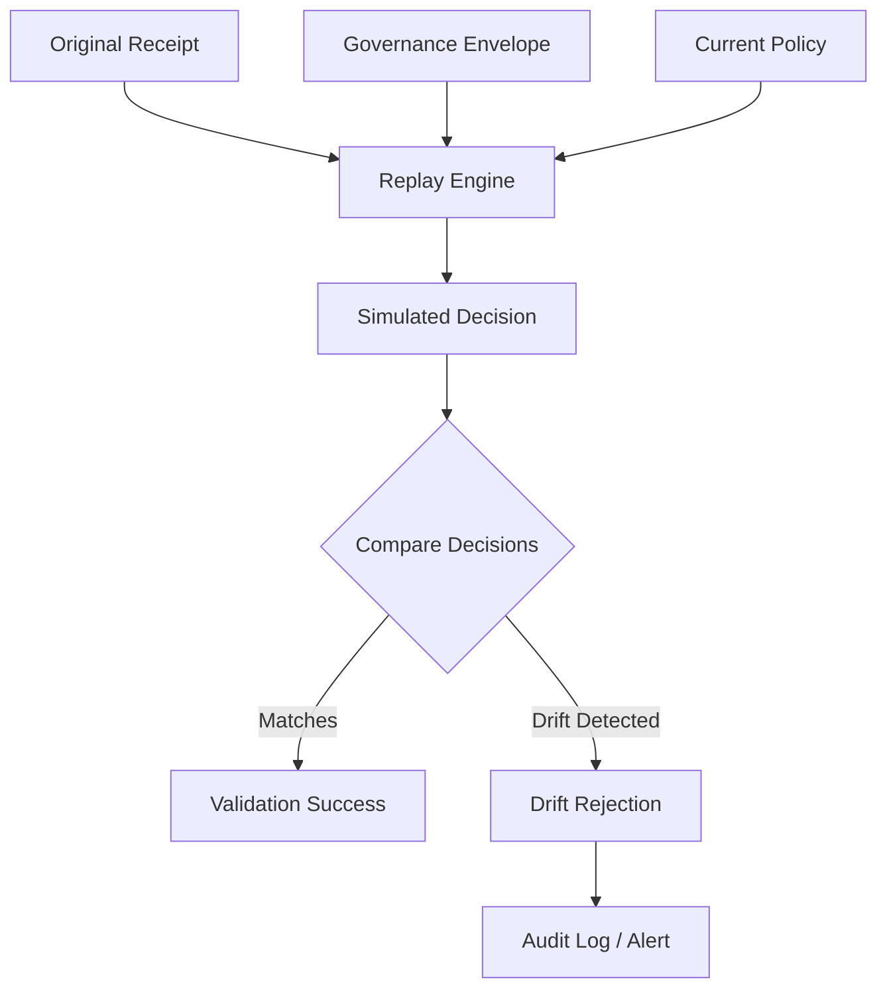
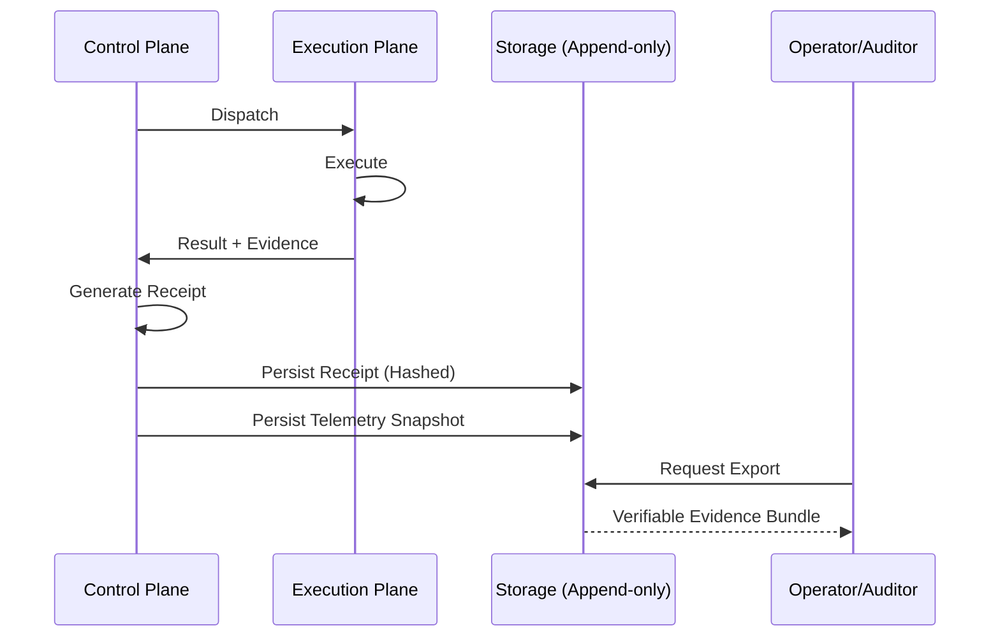

<!-- SPDX-FileCopyrightText: Copyright (c) 2026 NVIDIA CORPORATION & AFFILIATES. All rights reserved. -->
<!-- SPDX-License-Identifier: Apache-2.0 -->

# Governance Topology

This document details the governance-specific flows for replay, evidence, and trust within the substrate.

## Replay Validation Lifecycle

Replay ensures that past control-plane decisions remain deterministic and consistent with current policy.



## Evidence/Export Lifecycle

Every control decision generates a verifiable evidence trail for auditing and forensics.



## Trust/Attestation Lifecycle

Trust is earned through evidence and explicit operator approval; self-reported claims are treated as unverified.

```mermaid
graph TD
    Claim[Self-Reported Claim] --> Evidence[Probe-Observed Evidence]
    Evidence --> Evaluation[Trust Evaluation]
    
    Evaluation -- Low Confidence --> Unverified[Unverified State]
    Evaluation -- High Confidence --> Approval[Operator Approval Required]
    
    Approval -- Approved --> Trusted[Governed Trust Elevation]
    Approval -- Denied --> Blocked[Blocked Path]
    
    Trusted --> Attestation[Cryptographic Attestation (Planned)]
```
