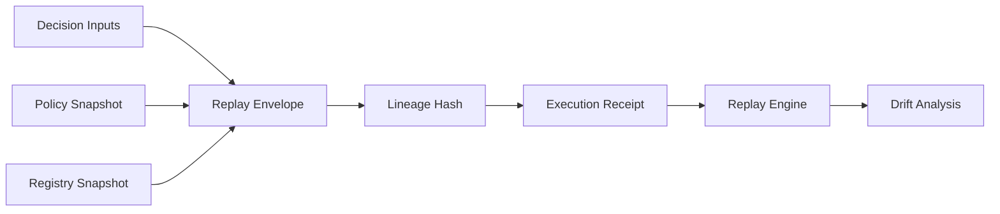
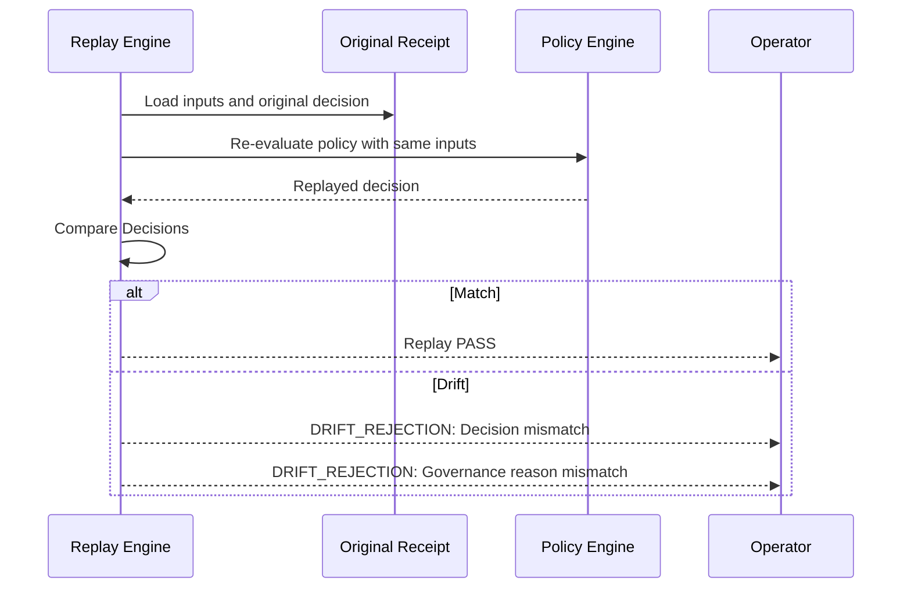

<!-- SPDX-FileCopyrightText: Copyright (c) 2026 NVIDIA CORPORATION & AFFILIATES. All rights reserved. -->
<!-- SPDX-License-Identifier: Apache-2.0 -->

# Replay Lineage

Replay lineage is the mechanism that ensures every control-plane decision can be reproduced, audited, and verified for consistency against the current policy state.

## Replay Envelope Lifecycle

A replay envelope captures the total state required to reproduce a control decision.

## Lineage Requirements

Every control decision must include the following lineage metadata:

- **`parent_receipt_id`:** Link to the preceding decision in the execution chain.
- **`lineage_hash`:** A stable hash of the input envelope (registry, policy, request).
- **`governance_reason`:** An explainable string or code justifying the selection/rejection.
- **`timestamp`:** UTC timestamp of the control decision (for ordering only, not for logic).

## Governance Reason Requirements

Governance reasons must be:

- **Machine-readable:** Using typed reason codes (e.g., `POLICY_DENY`, `CAPABILITY_MATCH`).
- **Human-explainable:** Including a concise description of the logic applied.
- **Attributable:** Linked to a specific policy version or registry snapshot.

## Deterministic Ordering and Tie-Breaks

To ensure replay integrity, all candidate evaluations must use stable, deterministic ordering.

- **Registry Inputs:** Sorted by stable identifier (e.g., UUID or Device ID).
- **Policy Rules:** Evaluated in a fixed, documented order.
- **Tie-Breaks:** Using stable secondary attributes (e.g., lexical sort on candidate name) rather than random selection.

## Drift Rejection

If the Replay Engine produces a different outcome than the original receipt, a **Drift Rejection** is triggered.

## Replay Integrity Boundaries

- **Input Invariance:** Replay must use the exact snapshots captured in the original envelope.
- **Policy Stability:** Replay can be used to test "what would happen under current policy" vs "what did happen", but the primary validation is against the original snapshot.
- **Side-Effect Isolation:** Replay only validates the control-plane decision; it does not re-execute the execution-plane side effects.
