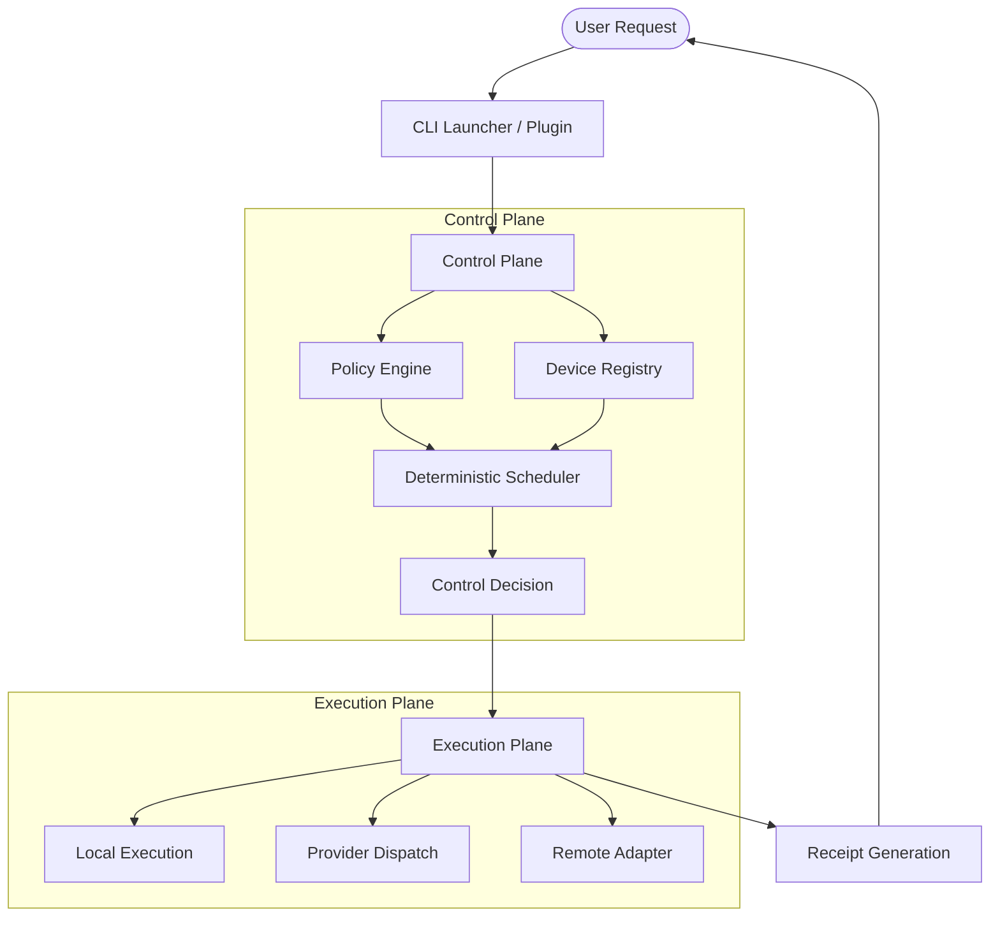
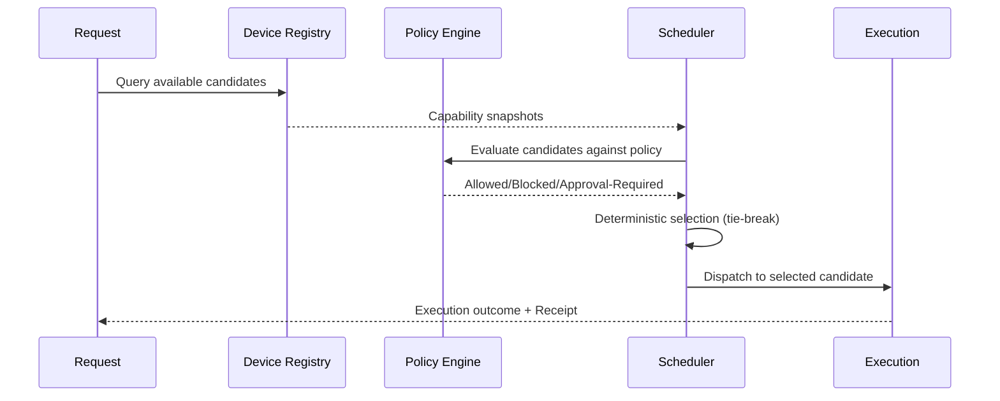
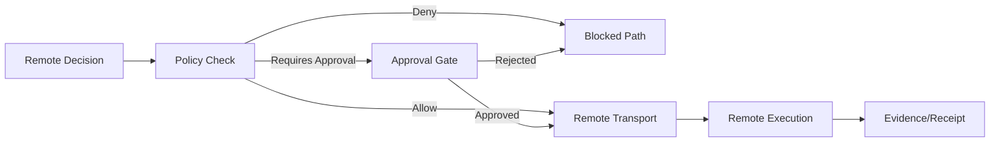
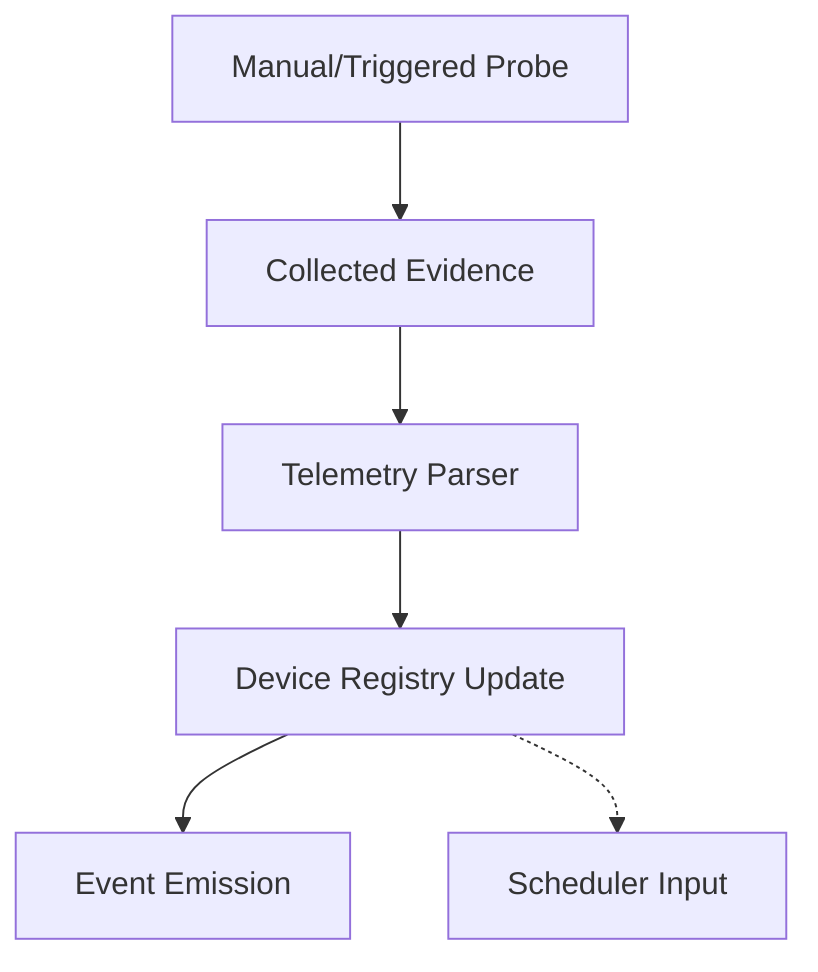

<!-- SPDX-FileCopyrightText: Copyright (c) 2026 NVIDIA CORPORATION & AFFILIATES. All rights reserved. -->
<!-- SPDX-License-Identifier: Apache-2.0 -->

# System Topology

This document maps the high-level system components and their interaction flows within the NemoClaw governed execution substrate.

## Runtime Dispatch Flow

The runtime dispatch flow separates control-plane decision logic from execution-plane mechanics.

## Heterogeneous Routing Flow

Heterogeneous routing enables selection across diverse local and remote execution candidates.

## Remote Execution Gate Flow

Remote execution is strictly gated by policy and explicit operator approval.

## Telemetry Lifecycle

Telemetry is observed through explicit probes and maintained as non-authoritative evidence.

