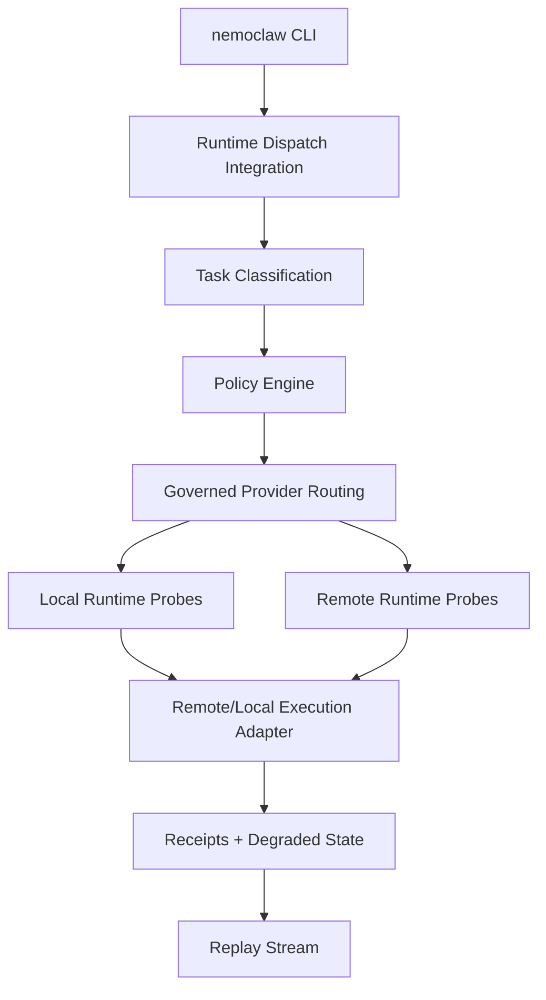
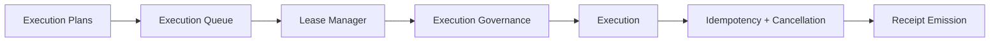
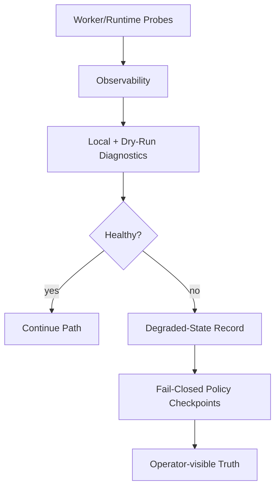

<!-- SPDX-FileCopyrightText: Copyright (c) 2026 NVIDIA CORPORATION & AFFILIATES. All rights reserved. -->
<!-- SPDX-License-Identifier: Apache-2.0 -->

# System Topology

This page consolidates governed substrate topology for release-candidate review. It is documentation-only and does not change runtime behavior.

## Runtime Dispatch and Heterogeneous Routing Topology

## Execution Plan and Queue/Lease Topology

## Diagnostics and Degraded-State Topology

