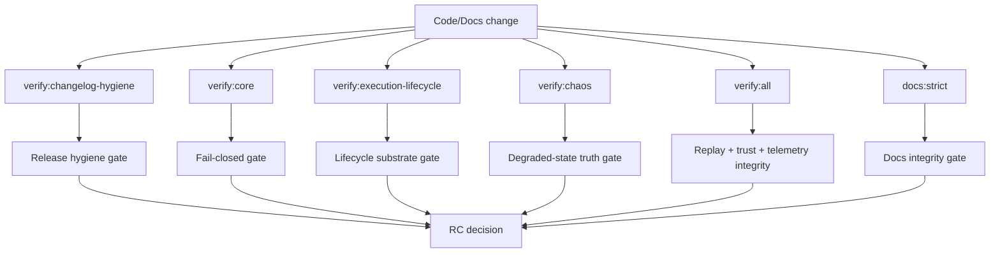

<!-- SPDX-FileCopyrightText: Copyright (c) 2026 NVIDIA CORPORATION & AFFILIATES. All rights reserved. -->
<!-- SPDX-License-Identifier: Apache-2.0 -->

# Verification Topology

## Verification command map

- `verify:release`: release gate aggregate (`verify:changelog-hygiene`, `verify:core`, `typecheck`, `lint`, `verify:chaos`)
- `verify:all`: strict core verification
- `verify:core`: governed substrate core checks
- `verify:execution-lifecycle`: deterministic execution plan, queue, lease, replay, proofpack, diagnostics, and anti-theatre coverage
- `verify:chaos`: degraded-state chaos scenarios
- `docs:strict`: Sphinx build with warnings-as-errors

## CI / Release Gate topology

