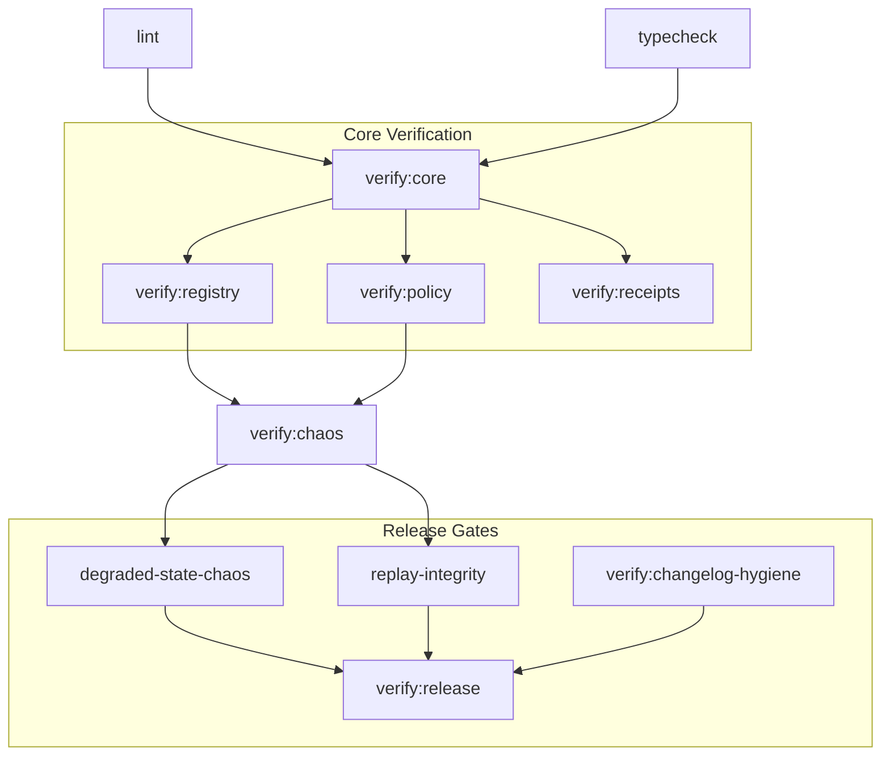

<!-- SPDX-FileCopyrightText: Copyright (c) 2026 NVIDIA CORPORATION & AFFILIATES. All rights reserved. -->
<!-- SPDX-License-Identifier: Apache-2.0 -->

# Verification Topology

This document maps the verification surface and release-gate architecture for the NemoClaw substrate.

## Command Dependency Graph

Verification tasks are organized to ensure foundational contracts are validated before high-level behaviors.

## CI Flow and Release Gates

The CI pipeline enforces a "fail-closed" posture, where any verification failure blocks progression to the next stage.

| Gate | Target | Purpose | Checkpoint |
|---|---|---|---|
| **L1: Hygiene** | `lint`, `format` | Prevent accidental entropy and style drift. | Pre-commit / CI |
| **L2: Static** | `typecheck` | Ensure contract alignment and API stability. | Pre-push / CI |
| **L3: Core** | `verify:core` | Validate fundamental control-plane logic. | CI |
| **L4: Chaos** | `verify:chaos` | Verify fail-closed behavior and degraded semantics. | CI (PR) |
| **L5: Release** | `verify:release` | Final check for changelog hygiene and documentation coherence. | Merge to main |

## Verification Mapping

| Category | Command / Suite | Focus Area |
|---|---|---|
| **Changelog** | `npm run verify:changelog-hygiene` | Semantic integrity of the release trail. |
| **Replay** | `npm run verify:replay-integrity` | Deterministic consistency of control decisions. |
| **Degraded State** | `npm run verify:degraded-state-chaos` | Surfacing explicit reason codes during failure. |
| **Telemetry** | `npm run verify:telemetry-validation` | Accuracy of probe-observed evidence. |
| **Trust** | `npm run verify:trust-validation` | Enforcement of operator-approved trust boundaries. |

## Fail-Closed Checkpoints

- **Policy Evaluation:** If policy cannot be evaluated, the scheduler must fail-closed and block execution.
- **Receipt Persistence:** If a receipt cannot be written, the transaction is considered unverified.
- **Drift Detection:** If replay detects non-deterministic drift, the audit trail is flagged for manual review.
